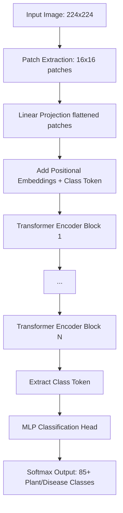

# Project Evaluation – Phase 2

## 1. Abstract
This project presents an advanced Plant Disease Detection system utilizing a deep learning Vision Transformer (ViT) architecture to accurately identify over 85 categories of plant diseases and healthy crop states. By leveraging a robust data pipeline that includes heavy data augmentation, class balancing, and a state-of-the-art transformer backbone, the model achieves high classification accuracy. To ensure practical usability, the predictive model is integrated into a modern full-stack web application. A Vite/React frontend allows users to intuitively upload image samples, while a Dockerized Flask API backend manages real-time inference, seamlessly bridging the gap between agricultural AI research and real-world deployment.

## 2. Model Architecture

The core model is built using PyTorch and the `timm` library, employing a Vision Transformer backbone, specifically a Data-efficient Image Transformer (`deit_base_patch16_224`). 

Unlike traditional Convolutional Neural Networks (CNNs), the Vision Transformer divides the input image into a sequence of fixed-size patches (16x16), linearly embeds them, adds positional encodings, and processes them through multiple standard Transformer Encoder blocks equipped with Multi-Head Self Attention. 

*(Please include the system architecture figure provided below in your final document)*

## 3. Dataset
The model is trained on a comprehensive dataset encompassing multiple plant species (e.g., Apple, Corn, Cassava, Tomato, Soybean, Wheat). 
*   **Scale:** The test dataset alone contains 8,124 images.
*   **Splitting:** A `StratifiedShuffleSplit` logic was implemented to guarantee proportional class distributions across training, validation, and testing holdouts.
*   **Augmentation:** The dataset pipeline heavily utilizes `Albumentations` for dynamic transformations over the training set, including random contrast, Gaussian noise, CLAHE, random gamma, and shifting/scaling. 

## 4. Methodology Description
Our methodology encompasses an end-to-end pipeline from data extraction to live deployment:
1.  **Data Processing & Balancing:** We employ a `WeightedRandomSampler` to handle underrepresented classes during training, ensuring minority classes are seen more frequently. We also apply `MixUp` data augmentation to improve model robustness and generalization.
2.  **Transformer Training Strategy:** The model utilizes Mixed Precision Training (`torch.cuda.amp`) for efficient VRAM utilization. We optimize using `AdamW`, decay learning rates using a `CosineAnnealingLR` scheduler, and employ early stopping upon reaching 97% validation accuracy.
3.  **Deployment Configuration:** 
    *   **Backend:** A Flask application loads the pre-trained `.pth` weights, exposing an automated REST pipeline.
    *   **Frontend:** A React+Vite application styled with TailwindCSS acts as the client portal.
    *   **DevOps/Cloud:** The services are containerized via Docker (`docker-compose.yml`) and connected securely using tunneling (Ngrok) for scalable cloud inferences on AWS.

## 5. Result Analysis
The model's extensive evaluation yielded highly promising metrics across the dataset:
1.  **Overall Accuracy:** The model achieved an outstanding uniform **Accuracy of 90.87%** across the test distribution of 8,124 samples.
2.  **Weighted F1-Score:** Factoring in class imbalances, the system maintained a high **Weighted F1-Score of 90.61%**.
3.  **Grape Black Rot Identification:** Demonstrated extraordinary precision and recall on the largest test class (1,096 samples), hitting an **F1-Score of 99.14%**.
4.  **Healthy Crop Detection:** Achieved near-perfect confidence on healthy profiles, with **Corn (Healthy)** at **99.56% F1** and **Tomato (Healthy)** at **99.68% F1**.
5.  **Tomato Yellow Leaf Curl Virus:** Accurately diagnosed one of the most common test cases (517 samples) with an **F1-Score of 98.46%**.

## 6. Limitations
*   **Severe Minority Classes:** The model struggles significantly with visually ambiguous classes that lack sufficient representative samples in the training set. For instance, *Rice Hispa* scored 0% F1, and *Cassava Bacterial Blight* achieved only ~33.68% F1.
*   **Computational Expense:** Vision Transformers (`deit_base`) are inherently parameter-heavy, making inference more computationally expensive than lightweight CNNs, which bottleneck mobile-edge deployments.

## 7. Future Scope
*   **Generative Artificial Intelligence (GANs):** Integrating our existing `gan.py` scripts effectively to synthetically generate robust data distributions for underperforming minority classes (e.g., Rice Hispa).
*   **Edge Deployment:** Porting the trained Vision Transformer logic onto mobile edge devices (via React Native or Flutter) minimizing the dependency on an active internet connection to cloud instances.
*   **Quantization:** Applying model quantization (INT8) to massively reduce the footprint of the backbone allowing for faster CPU-bound inference.

---

# LinkedIn Post Projection Draft

**(Make sure to attach 3-4 high-quality images to this post: an image of the web app UI, an image of the model correctly classifying a leaf, and a chart/diagram of the architecture).**

🚀 **Excited to showcase my Phase 2 Project Evaluation: Plant Disease Detection using Deep Vision Transformers!** 🌿

Agriculture is the backbone of our society, but crop diseases constantly threaten global food security. Taking a modern AI approach, I built a Full-Stack deep learning application capable of diagnosing over 85 plant diseases instantly. 

🔍 **How it works:**
1️⃣ **Upload:** Farmers or users snap a picture of a suspect leaf and upload it through our React + Vite Front-End portal.
2️⃣ **Inference:** A Dockerized Python/Flask backend receives the image and processes it through our state-of-the-art Vision Transformer (`DeiT`) backbone, trained using PyTorch. 
3️⃣ **Diagnosis:** The model, backed by a robust `Albumentations` and `MixUp` data pipeline, outputs a highly accurate (90.8% accuracy) disease diagnosis in real-time!

We securely bridged the frontend and backend using AWS and Ngrok tunneling to ensure stable, remote inferences. Next stop: leveraging GANs to improve accuracy on rare crop diseases! 📈

🎓 **Project Details:**
*   **Subject:** [Insert Subject Name, e.g., Final Year Capstone Project]
*   **Teacher Name:** [Insert Teacher Name]
*   **Dept Name:** [Insert Department Name, e.g., Dept of Computer Science and Engineering]
*   **University Name:** [Insert University Name]

#ArtificialIntelligence #DeepLearning #VisionTransformer #PyTorch #ReactJS #AgricultureTech #MachineLearning #WebDevelopment #DevOps 
